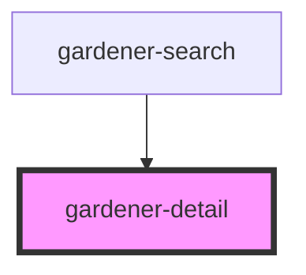

# gardener-detail

<!-- Auto Generated Below -->

## Properties

| Property | Attribute | Description | Type  | Default     |
| -------- | --------- | ----------- | ----- | ----------- |
| `record` | `record`  |             | `any` | `undefined` |

## Events

| Event            | Description | Type               |
| ---------------- | ----------- | ------------------ |
| `recordSelected` |             | `CustomEvent<any>` |

## Dependencies

### Used by

 - [gardener-search](../gardener-search)

### Graph

----------------------------------------------

*Built with [StencilJS](https://stenciljs.com/)*
