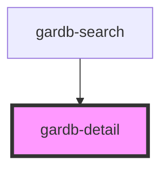

# gardb-detail

<!-- Auto Generated Below -->

## Properties

| Property | Attribute | Description | Type  | Default     |
| -------- | --------- | ----------- | ----- | ----------- |
| `record` | `record`  |             | `any` | `undefined` |

## Events

| Event            | Description | Type                            |
| ---------------- | ----------- | ------------------------------- |
| `recordSelected` |             | `CustomEvent<CustomEvent<any>>` |

## Dependencies

### Used by

 - [gardb-search](../gardb-search)

### Graph

----------------------------------------------

*Built with [StencilJS](https://stenciljs.com/)*
