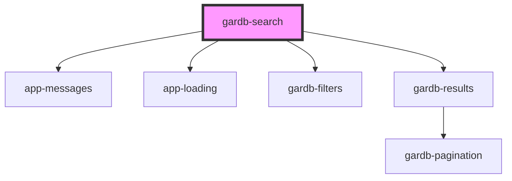

# gardb-search

<!-- Auto Generated Below -->

## Properties

| Property | Attribute | Description | Type      | Default     |
| -------- | --------- | ----------- | --------- | ----------- |
| `api`    | `api`     |             | `string`  | `undefined` |
| `debug`  | `debug`   |             | `boolean` | `false`     |

## Dependencies

### Depends on

- [app-messages](../app-messages)
- [app-loading](../app-loading)
- [gardb-filters](../gardb-filters)
- [gardb-results](../gardb-results)

### Graph

----------------------------------------------

*Built with [StencilJS](https://stenciljs.com/)*
