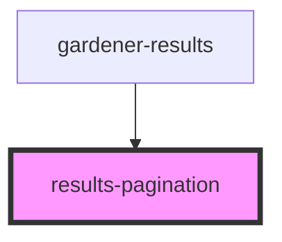

# results-pagination

<!-- Auto Generated Below -->

## Properties

| Property      | Attribute      | Description | Type     | Default     |
| ------------- | -------------- | ----------- | -------- | ----------- |
| `currentPage` | `current-page` |             | `number` | `undefined` |
| `pages`       | `pages`        |             | `number` | `undefined` |

## Events

| Event          | Description | Type               |
| -------------- | ----------- | ------------------ |
| `pageSelected` |             | `CustomEvent<any>` |

## Dependencies

### Used by

 - [gardener-results](../results)

### Graph

----------------------------------------------

*Built with [StencilJS](https://stenciljs.com/)*
